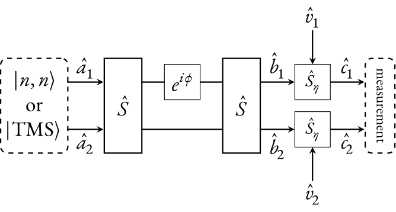
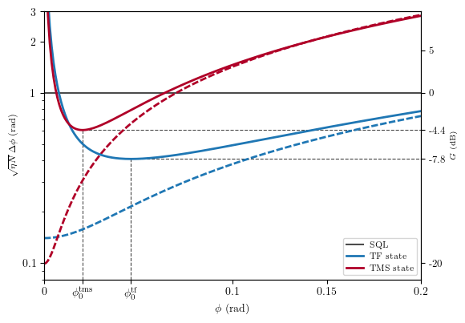
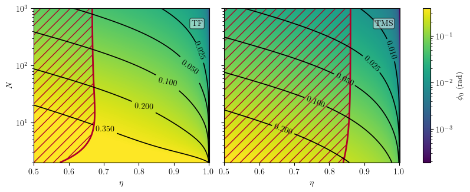
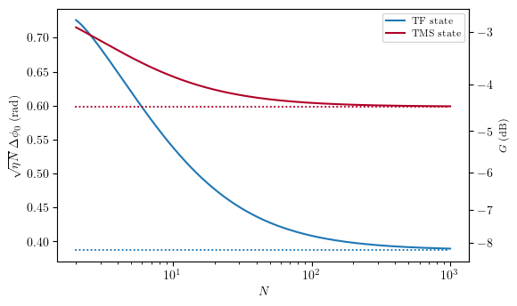

# Python package about interferometry using two-mode quantum states

## This package provides functions that return various physical quantities related to interferometry experiments using twin Fock states $|n,n\rangle$ or two-mode squeezed vacuum states

### Functions contained in this package are derived in [this article](link)
* DOI: *paper published soon*
---

## Quick context explanation

The scheme of the experiment that we aer considering is represented with the figure below:

* **twin Fock** or **two-mode squeezed** states are used as *input* in a Mach-Zehnder interferometer ;
* the detection suffers from a **non-unit quantum efficiency** $\eta$ ;
* experimentalists are interested in the measurement of the phase difference $\phi$ between the two arms ;
* the observable $\hat{O}$ that one use to perform a measurement is the **square** of the *half difference* of particles detected at both output ports $\hat{c}_1$ and $\hat{c}_2$, whose expectation value is actually the **variance** of the *half difference* of particles detected (cf. note below):

```math
\hat{O} = \frac{1}{4} \left( \hat{N}_{c_2} - \hat{N}_{c_1} \right)^2
```

* detailed explanation about the derivation of the formulae are given in the [supplemental material](link) of the article ;

(note): indeed, 

```math
\langle\hat{N}_{c_2}-\hat{N}_{c_1}\rangle=0
```

and therefore 

```math
4\times\mathrm{Var}\left[\hat{O}\right]=\left\langle\left(\hat{N}_{c_2}-\hat{N}_{c_1}\right)^2\right\rangle-\left\langle\hat{N}_{c_2}-\hat{N}_{c_1}\right\rangle^2=\left\langle\left(\hat{N}_{c_2}-\hat{N}_{c_1}\right)^2\right\rangle
```

---

## Installation

#### Method 1: download from PyPI (recommended for users)
This package is published in the PyPI repository, it can be added to any Python environment with
the oneliner:
`pip install qsipy`

Or with any other Python packaging and dependency manager, such as poetry:
`poetry add qsipy`

#### Method 2: cloning from the source (for contributers)

You may also clone this project and use it right away. Since it is only Python scripts
no compilation is needed. The functions of interest are defined in two separate modules:
* `src/qsipy/tfs.py` $\Rightarrow$ for the functions related to the *twin Fock states*
* `src/qsipy/tms.py` $\Rightarrow$ for the functions related to the *two-mode squeezed vacuum states* 
---

## Examples

**N.B.** the gain in decibels (relatively to the standard quantum limit) are defined as such:

$$ G = 20 \log \left[ \sqrt{\eta N} \, \Delta \phi \right]$$ 

#### 1. Phase uncertainty $\Delta \phi$ as a function of the measured phase difference

The following figure shows the **ratio** between the **phase sensitivity** achieved with those two quantum states **and the shot-noise**. The quantum efficiency is set to $\eta = 0.95$. It shows in particular that interferometry [below the standard quantum limit (SQL)](https://arxiv.org/abs/1405.7703) can be obtained in specific ranges of phase differences $\phi$.



The source code generating this figure [can be found here](images/FIG_tf_vs_tms/qsipy_tf_vs_tms.py).

#### 2. Maps of the optimal $\phi_0$ to measure, and sub-shot-noise domains

The example 1. exhibited the fact that (for given quantum efficiency $\eta$ and number of particles $N$) there is an optimal phase difference $\phi_0$ to measure, in order to minimize the measurement uncertainty $\Delta \phi$. One can plot the maps of those optimal phases in the $(\eta,N)$ plane, and identify the regions where sub-shot-noise interferometry may be performed.

* `TF` stands for *twin Fock* state
* `TMS` stands for *two-mode squeezed vacuum* state



The source code generating this figure [can be found here](images/FIG_optimal_phi/qsipy_optimal_phi.py).

#### 3. Asymptotic behaviour of the phase uncertainty

Knowing the optimal phase $\phi_0$ to estimate, one can study the asymptotic behaviour of $\Delta \phi_0 = \left.\Delta \phi\right|_{\phi=\phi_0}$. One can therefore check that as soon as $\eta \neq 1$, $\Delta \phi_0$ has a $\mathcal{O}(N^{-1/2})$ scaling, therefore overtaking the standard quantum limit only by a constant factor.
Here is a visualization of this asymptotic behaviour in the case $\eta = 0.95$



The source code generating this figure [can be found here](images/FIG_asymptotic_behaviour/qsipy_asymptotic_behaviour.py).

---

## User guide

Currently the package is organized in two main modules `tfs` and `tms`, containing essentially the same functions, but considering either *twin Fock* or *two-mode squeezed* states at the input.

**Important abbreviations:** for the sake of compactness we use the following abbreviation in the names of the functions provided by `qsipy`:
* `ev` stands for *"expectation value"*
* `vhd` stands for *"variance of the half difference"*
* `qe` stands for *"quantum efficiency"* (i.e. the value of $\eta$)

Here is the listing of the useful functions that one can use, calling `tfs.`*myfunction*
or `tfs.`*myfunction*:

#### Most important functions

```python
def phase_uncertainty_vhd(
    phi: float | npt.NDArray[np.float_],
    N: float | npt.NDArray[np.float_],
    eta: float | npt.NDArray[np.float_] = 1,
) -> float | npt.NDArray[np.float_]:
    """Returns the phase uncertainty during an interferometry experiment using
        - twin-Fock or two-mode squeezed states at the input (depending from which module
            the function has been called);
        - considering the variance of the half difference of particles detected at the
            output as the observable of interest;

    This function only calls either "phase_uncertainty_vhd_perfect_qe" or
    "phase_uncertainty_vhd_finite_qe", depending on the value of eta that it is set as
    argument.

    Parameters
    ----------
    phi : float | npt.NDArray[np.float_]
        Phase difference between both arms of the interferometer.
    N : float | npt.NDArray[np.float_]
        Total number of particles.
    eta : float | npt.NDArray[np.float_], optional
        Quantum efficiency of the detector, must be between 0 and 1, by default 1.

    Returns
    -------
    float | npt.NDArray[np.float_]
        Phase uncertainty.
    """
```

```python
def optimal_phi_vhd(
    N: float | npt.NDArray[np.float_],
    eta: float | npt.NDArray[np.float_] = 1,
) -> float | npt.NDArray[np.float_]:
    """Returns the optimal phase to estimate (minimizing the resolution) during an
    interferometry experiment using detectors with finite quantum efficiency and
    considering the variance of the half difference of particles detected at the output
    as the observable of interest. The detectors have a finite quantum efficiency eta.

    Parameters
    ----------
    N : float | npt.NDArray[np.float_]
        Total number of particles.
    eta : float | npt.NDArray[np.float_], optional
        Quantum efficiency of the detector, must be between 0 and 1, by default 1.

    Returns
    -------
    float | npt.NDArray[np.float_]
        Optimal phase to estimate experimentally.
    """
```

```python
def phase_uncertainty_at_optimal_phi_vhd(
    N: float | npt.NDArray[np.float_],
    eta: float | npt.NDArray[np.float_] = 1,
) -> float | npt.NDArray[np.float_]:
    """Returns the resolution at the optimal phase to estimate during an interferometry
    experiment using detectors with finite quantum efficiency eta and considering the
    variance of the difference of particles at the output as the observable of interest.
    This function is therefore just:

    phase_resolution_difference_finite_qe(optimal_phi_vhd(n, eta), n, eta)

    Parameters
    ----------
    N : float | npt.NDArray[np.float_]
        Total number of particles.
    eta : float | npt.NDArray[np.float_], optional
        Quantum efficiency of the detector, must be between 0 and 1, by default 1.

    Returns
    -------
    float | npt.NDArray[np.float_]
        Optimal resolution.
    """
```

#### Functions with more specific usage

```python
def ev_vhd(
    phi: float | npt.NDArray[np.float_],
    N: float | npt.NDArray[np.float_],
    eta: float | npt.NDArray[np.float_] = 1,
) -> float | npt.NDArray[np.float_]:
    """Returns the expectation value of the variance of the half difference of number of
    particles detected at both output ports of the interferometer.
    Since the expectation value of the difference itself is zero, the variance is
    actually equal to the expectation value of the square of the difference.

    This function only calls either "ev_vhd_perfect_qe" or "ev_vhd_finite_qe", depending
    on the value of eta that it is set as argument.

    Parameters
    ----------
    phi : float | npt.NDArray[np.float_]
        Phase difference between both arms of the interferometer.
    N : float | npt.NDArray[np.float_]
        Average total number of particles in the interferometer.
    eta : float | npt.NDArray[np.float_], optional
        Quantum efficiency of the detector, must be between 0 and 1, by default 1.

    Returns
    -------
    float | npt.NDArray[np.float_]
        Expectation value: <(1/4) * (N_output1 - N_output2) ** 2>
    """
```

```python
def ev_vhd_squared(
    phi: float | npt.NDArray[np.float_],
    N: float | npt.NDArray[np.float_],
    eta: float | npt.NDArray[np.float_] = 1,
) -> float | npt.NDArray[np.float_]:
    """Returns the expectation value of the power four of the half difference of number
    of particles detected at both output ports of the interferometer.

    This function only calls either "ev_vhd_squared_perfect_qe" or
    "ev_vhd_squared_finite_qe", depending on the value of eta that it is set as
    argument.

    Parameters
    ----------
    phi : float | npt.NDArray[np.float_]
        Phase difference between both arms of the interferometer.
    N : float | npt.NDArray[np.float_]
        Total number of particles.
    eta : float | npt.NDArray[np.float_], optional
        Quantum efficiency of the detector, must be between 0 and 1, by default 1.

    Returns
    -------
    float | npt.NDArray[np.float_]
        Expectation value: <(1/16) * (N_output1 - N_output2) ** 4>
    """
```

```python
def fluctuations_vhd(
    phi: float | npt.NDArray[np.float_],
    N: float | npt.NDArray[np.float_],
    eta: float | npt.NDArray[np.float_] = 1,
) -> float | npt.NDArray[np.float_]:
    """Returns the quantum fluctuations of the variance of the half difference of number
    of particles detected at both output ports of the interferometer.

    This function only calls either "fluctuations_vhd_perfect_qe" or
    "fluctuations_vhd_finite_qe", depending on the value of eta that it is set as
    argument.

    Parameters
    ----------
    phi : float | npt.NDArray[np.float_]
        Phase difference between both arms of the interferometer.
    N : float | npt.NDArray[np.float_]
        Total number of particles.
    eta : float | npt.NDArray[np.float_], optional
        Quantum efficiency of the detector, must be between 0 and 1, by default 1.

    Returns
    -------
    float | npt.NDArray[np.float_]
        Expectation value: <Sqrt[Var( Var{ (1/2) * (N_output1 - N_output2) } )]>
    """
```

```python
def asymptotic_ratio_phase_uncertainty_to_SQL_at_optimal_phi_vhd(
    eta: float | npt.NDArray[np.float_],
) -> float | npt.NDArray[np.float_]:
    """Returns the asymptotic limit (as the number of particles goes to infinity) of the ratio between:
        - the phase uncertainty at the optimal phase and considering the variance of the half difference
        of particles detected at the output as the observable of interest
        - the SQL 1/sqrt(eta N).

    It only depends on the quantum efficiency of the detectors.

    Parameters
    ----------
    eta : float | npt.NDArray[np.float_]
        Quantum efficiency of the detector, must be between 0 and 1.

    Returns
    -------
    float | npt.NDArray[np.float_]
        Optimal phase uncertainty to SQL ratio in the asymptotic limit of N.
    """
```
